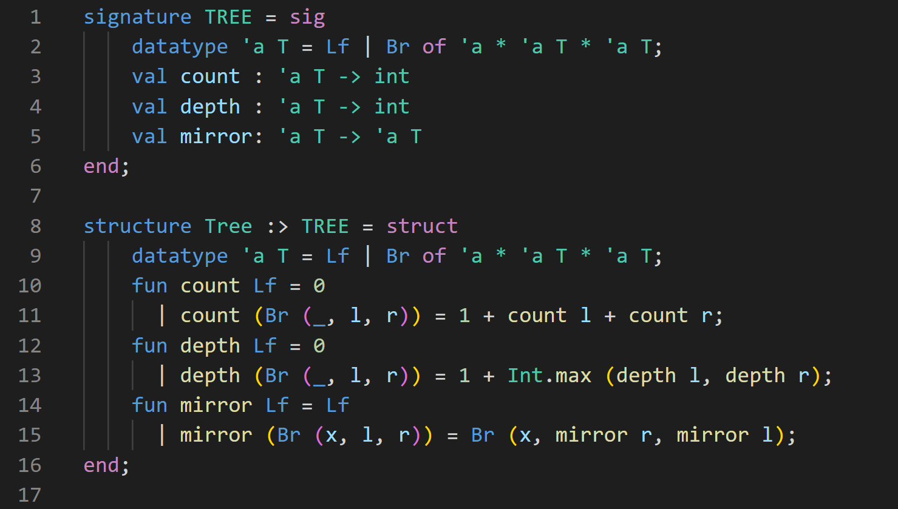
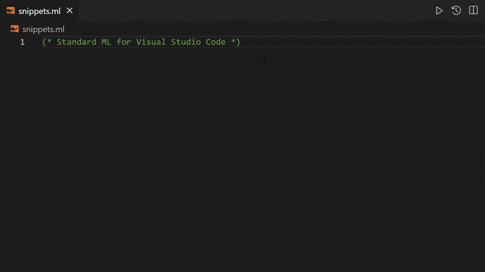

 

# ML/Standard ML for Visual Studio Code

The **ML/Standard ML** extension adds language support for ML/Standard ML to Visual Studio Code, including syntax highlighting<!--, editing (IntelliSense) and code running features.--> and code editing features. Support for an extended Successor ML-like syntax can be enabled from the extension settings.

## Features

* **Advanced Syntax Highlighting** - Enhances code readability by contextually coloring text beyond basic syntax, aiding in understanding complex structures.

 

<!--* **IntelliSense** - Provides smart completions based on variable types, function definitions, and imported modules, enhancing coding efficiency and accuracy.-->
* **Code Editing** - Offers advanced editing capabilities tailored for ML/Standard ML programming, including the use of snippets for faster and error-free coding.

 

<!--
## Requirements

## Extension Settings

This extension contributes the following settings:

* `myExtension.enable`: Enable/disable this extension.
* `myExtension.thing`: Set to `blah` to do something.

## Known Issues

Calling out known issues can help limit users opening duplicate issues against your extension.
-->

>  **Enjoy learning ML! 🎉**

## Contributing

This is an open source project and contributions from the community are warmly accepted! Whether it's fixing bugs, adding new features, or improving documentation, your help is greatly appreciated.

If you're interested in improving the **ML/Standard ML** extension for Visual Studio Code, please take a look at the [contributing guidelines](CONTRIBUTING.md) for information on how to get started.

---

**Developed with ❤️ by Valenino Cioffi and contributors** 

